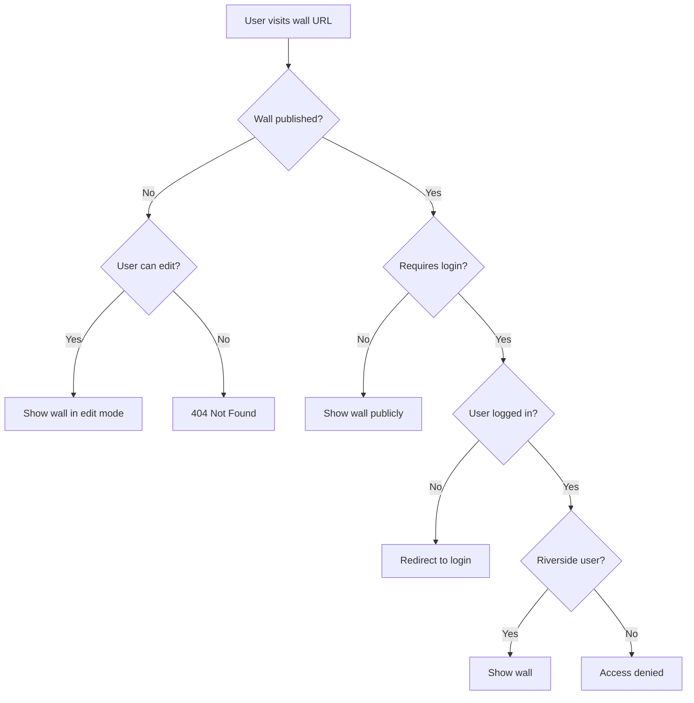
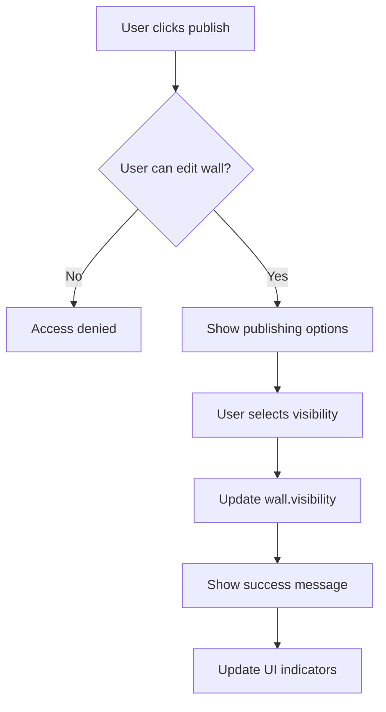

# Wall Visibility System

## Overview
The Riverside Wall App supports flexible visibility options for published walls, allowing content creators to control who can view their walls and under what conditions.

## Visibility States

### 1. Draft (Unpublished)
**Access:** Editors only  
**Description:** Wall is being actively worked on and not ready for public viewing.

- Only users with edit permissions can view
- Not listed in public wall directories
- Can be collaboratively edited
- Perfect for preparation and review phases

**Use Cases:**
- Preparing a bulletin board for upcoming events
- Collaborative content creation between teachers
- Review and approval workflows

### 2. Published - Public
**Access:** Anyone (no login required)  
**Description:** Wall is publicly accessible to anyone with the link.

- Visible to all users (authenticated and anonymous)
- Can be shared via direct links
- Searchable/discoverable in public listings
- Read-only for non-editors

**Use Cases:**
- School announcements visible to parents
- Public event information
- Community bulletin boards
- Emergency information displays

### 3. Published - Login Required
**Access:** Authenticated Riverside users only  
**Description:** Wall requires Riverside Google account login to view.

- Only accessible to logged-in Riverside staff/students
- Protected from external viewing
- Suitable for internal communications
- Read-only for non-editors

**Use Cases:**
- Staff-only announcements
- Internal policy updates
- Student work displays (privacy protected)
- Department-specific communications

## Implementation Details

### Database Schema
```typescript
interface WallVisibility {
  isPublished: boolean;     // Is wall published?
  requiresLogin: boolean;   // Requires authentication to view?
  publishedAt?: Date;       // When was it published?
  publishedBy?: string;     // Who published it?
  scheduledUnpublish?: Date; // Auto-unpublish date (future feature)
}
```

### URL Structure
```
Draft walls:
/wall/{id}/edit    (editors only)

Published public walls:
/wall/{id}         (anyone)
/public/{id}       (SEO-friendly alias)

Published login-required walls:
/wall/{id}         (authenticated users only)
/internal/{id}     (clear indication of requirement)
```

### Security Implementation

#### Frontend Route Guards
```typescript
// Public wall route (no guard needed)
{ path: 'wall/:id', component: WallViewerComponent }

// Login-required wall route
{ 
  path: 'internal/:id', 
  component: WallViewerComponent,
  canActivate: [AuthGuard]
}

// Draft wall route
{ 
  path: 'wall/:id/edit', 
  component: WallEditorComponent,
  canActivate: [AuthGuard, EditPermissionGuard]
}
```

#### Firestore Security Rules
```javascript
// Wall read access
allow read: if 
  // Draft - editors only
  (!resource.data.visibility.isPublished && canEdit()) ||
  // Published public - anyone
  (resource.data.visibility.isPublished && 
   !resource.data.visibility.requiresLogin) ||
  // Published login-required - authenticated only
  (resource.data.visibility.isPublished && 
   resource.data.visibility.requiresLogin && 
   request.auth != null && 
   request.auth.token.email.matches('.*@riverside\\.k12\\.ca\\.us$'));
```

## User Interface Design

### Wall Status Indicators
```typescript
// Visual indicators in wall lists
interface StatusIndicator {
  icon: string;
  color: string;
  tooltip: string;
}

const statusIndicators = {
  draft: { 
    icon: '🔒', 
    color: 'gray', 
    tooltip: 'Draft - Editors only' 
  },
  publicPublished: { 
    icon: '🌐', 
    color: 'green', 
    tooltip: 'Published - Public access' 
  },
  loginRequired: { 
    icon: '👥', 
    color: 'blue', 
    tooltip: 'Published - Login required' 
  }
};
```

### Publishing Controls
```html
<!-- Wall editor publishing section -->
<div class="publishing-controls">
  <h3>Publishing Options</h3>
  
  <div class="visibility-options">
    <label>
      <input type="radio" name="visibility" value="draft" />
      🔒 Keep as Draft (Editors only)
    </label>
    
    <label>
      <input type="radio" name="visibility" value="public" />
      🌐 Publish Publicly (Anyone can view)
    </label>
    
    <label>
      <input type="radio" name="visibility" value="loginRequired" />
      👥 Publish for Riverside Users (Login required)
    </label>
  </div>
  
  <div class="publish-actions">
    <button (click)="publishWall()">Publish Wall</button>
    <button (click)="unpublishWall()">Unpublish</button>
  </div>
</div>
```

### Share Links
```typescript
// Generate appropriate share links
getShareLink(wall: Wall): string {
  const baseUrl = 'https://riverside-wall-app.web.app';
  
  if (!wall.visibility.isPublished) {
    return `${baseUrl}/wall/${wall.id}/edit`; // Edit link for drafts
  }
  
  if (wall.visibility.requiresLogin) {
    return `${baseUrl}/internal/${wall.id}`; // Login required
  }
  
  return `${baseUrl}/wall/${wall.id}`; // Public access
}

// Share link component
getShareMessage(wall: Wall): string {
  if (wall.visibility.requiresLogin) {
    return `Check out "${wall.title}" - Riverside staff login required: ${this.getShareLink(wall)}`;
  }
  
  return `Check out "${wall.title}": ${this.getShareLink(wall)}`;
}
```

## Access Control Flows

### Viewing a Wall


### Publishing a Wall


## Future Enhancements

### Scheduled Publishing
- Set future publish dates
- Automatic unpublishing
- Time-limited visibility

### Access Analytics
- View counts by user type
- Popular content tracking
- Access attempt logging

### Advanced Sharing
- QR codes for public walls
- Embed codes for websites
- Social media integration

### Visibility Presets
- Template-based visibility settings
- Department default policies
- Bulk visibility management

## SEO and Discovery

### Public Walls
- Include in sitemap
- Meta tags for social sharing
- Search engine indexing allowed

### Login-Required Walls
- Exclude from sitemap
- No-index meta tags
- Private from search engines

### Draft Walls
- Completely hidden from discovery
- No public URLs
- Editor-only access